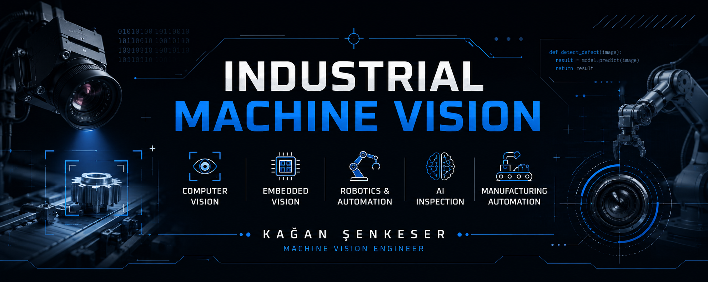

  

# Kağan Şenkeser

### Machine Vision Engineer

Machine Vision Engineer with industrial experience in designing, developing, and integrating vision systems for manufacturing automation. My work focuses on industrial machine vision, computer vision, embedded vision, and AI-powered inspection systems.

---

## About Me

- 🔹 Machine Vision Engineer with hands-on industrial experience
- 🔹 Experienced in developing machine vision applications for quality inspection and manufacturing automation
- 🔹 Interested in industrial optics, camera calibration, image processing, and embedded vision systems
- 🔹 Currently building an open-source portfolio inspired by real-world industrial machine vision applications

---

## Technical Skills

### Programming

- Python
- C

### Computer Vision & AI

- OpenCV
- HALCON
- YOLOv8 (Ultralytics)
- MediaPipe
- PyTorch
- TensorFlow
- Keras
- NumPy

### Industrial Machine Vision

- Cognex In-Sight
- Keyence IV Series
- Industrial Cameras
- Smart Cameras
- Camera Calibration
- Optical Systems
- Lighting Design
- Lens Selection
- Barcode Reading
- OCR
- Defect Detection

### Embedded Systems

- Raspberry Pi
- Arduino
- UART
- SPI
- I²C
- GPIO

### Robotics & Automation

- ABB RobotStudio
- Universal Robots (UR)
- Machine Vision Integration

### Tools

- Linux
- Git
- Bambu Studio

---

## Featured Projects

🚧 This section is currently under development.

Upcoming repositories will include real-world industrial machine vision examples such as:

- Camera Calibration Toolkit
- Industrial Barcode Inspection
- OCR Inspection System
- Industrial Measurement System
- Template Matching Inspection
- Defect Detection Toolkit

Each project will include:

- Documentation
- Source Code
- Demonstration GIFs
- Technical Explanation

---

## Current Focus

Currently developing high-quality open-source projects that demonstrate industrial machine vision concepts using OpenCV, Python, and embedded systems.

The goal is to build a practical portfolio inspired by real manufacturing automation challenges while respecting industrial confidentiality.

---

## Contact

📧 **Email**

**kagansenkeser@gmail.com**

💼 **LinkedIn**

**https://linkedin.com/in/kagan-senkeser**
